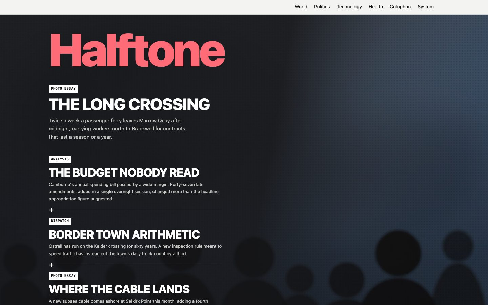

# Halftone

A photo-led newsmagazine theme for Astro: the picture leads, the type is laid on it, and the
density lives in the rail beside the piece. Free and MIT-licensed.

[Live demo](https://halftone-free.ondelva.com) · [Pro demo](https://halftone.ondelva.com) · [Get Pro](https://buy.polar.sh/polar_cl_3X186IpxV4IC54Eh871nUsDz0RUkPeSj49y0r01UDcx)



## What it is

The other magazine themes make hierarchy out of type. Halftone makes it out of a photograph. The
home page is a **cover plate** — one large picture with the wordmark, the lead headline and the
cover lines set inside it — and the article page opens the same way.

The signature is the **cover line**: a labelled teaser set on the plate, a kicker box, a headline
and a short deck, one under the next. It repeats on the home cover and on every desk front.

The axis is the **desk**, not the issue, so the magazine publishes continuously. Ink is real black,
the paper is cold rather than cream, and the spot colour is printed as a field — the wordmark and
the kicker boxes — not as dots on labels. No rounded cards, no shadows, no gradients.

## Features

- Astro 7 + Tailwind CSS v4, static output, zero client-side JS on a default build
- Cover plates and cover lines, the signature this theme is built on
- Four desks, desk fronts with pagination, an article rail (figures, more from the desk)
- Three article formats: a report with the rail beside it, a brief, a photo essay
- Contributor bios, related reading, reading time, dark mode, responsive from 360px
- Feed, sitemap, `robots.txt`, JSON-LD, share cards from the article's own photograph
- Analytics slot (Plausible, GA4, Umami), off until you name a provider
- Lighthouse 95+ on all four categories, WCAG AA on every colour pair, both checked in CI
- Type-safe content collections (Markdown and MDX), and `AGENTS.md` for Claude Code / Cursor

## Quick start

You need Node.js 22.12+ and pnpm 9 or newer (`npm i -g pnpm`). `package.json` pins the exact pnpm
version, and pnpm 10+ switches to it on its own.

```sh
pnpm create astro@latest my-magazine -- --template ondelva/astro-theme-halftone
cd my-magazine
pnpm install
pnpm dev
```

`pnpm dev` also serves `/styleguide`, where every colour token and type size is on one page.

## Configure

Everything site-specific lives in `src/config.ts`: name, URL, navigation, social links, the cover
lines and the analytics slot. Colours are tokens you override in `src/styles/theme.css`; fonts are
in `astro.config.mjs`.

- [docs/customization.md](docs/customization.md) — every config group, the tokens, the switches
- [docs/content.md](docs/content.md) — the three collections and every field
- [docs/components.md](docs/components.md) — what each component is for and what it takes
- [docs/deploy.md](docs/deploy.md) — build, hosting, CI

## Deploy

Static output. Works on Cloudflare, Vercel, Netlify and GitHub Pages. One click and the host clones
this repository into your account, builds it and puts it online:

[](https://deploy.workers.cloudflare.com/?url=https://github.com/ondelva/astro-theme-halftone)
[](https://app.netlify.com/start/deploy?repository=https://github.com/ondelva/astro-theme-halftone)
[](https://vercel.com/new/clone?repository-url=https://github.com/ondelva/astro-theme-halftone)

Set `SITE_URL` to your address afterwards. See [docs/deploy.md](docs/deploy.md).

## Footer credit

The footer carries one line crediting the theme — `Halftone theme by Ondelva`, linking to this
repository. It is a plain link in `src/layouts/Base.astro`; delete it if you would rather not have
it. Keeping it is how the next person finds the theme. Halftone Pro ships without it.

## Free vs Pro

Halftone Pro is the same magazine with the second axis through it — the ways across, the reading
apparatus and the integrations. See it running at [halftone.ondelva.com](https://halftone.ondelva.com),
and [buy it here](https://buy.polar.sh/polar_cl_3X186IpxV4IC54Eh871nUsDz0RUkPeSj49y0r01UDcx) — $49 for one person,
$129 for a team of up to ten.

|                | Free (this repo)                                | Pro                                                           |
| -------------- | ----------------------------------------------- | ------------------------------------------------------------- |
| Pages          | Home, desk fronts, article, colophon, 404, feed | + series, tags, contributor pages, archive, search, legal set |
| Article rail   | Figures blocks, more from the desk              | + contents built from the subheads, series navigation         |
| MDX components | –                                               | Callout, pull quote, table of figures, code-block copy        |
| Search         | –                                               | Pagefind                                                      |
| Languages      | UI strings in `src/i18n/`                       | + routing, language switch, per-article `lang`                |
| Colour presets | 1                                               | 4                                                             |
| Font pairings  | 1                                               | 3                                                             |
| Cover lines    | `stack`                                         | + `numbered`, `columns`                                       |
| Share cards    | The article's photograph                        | + a drawn plate for the pages that have none                  |
| Integrations   | Analytics (Plausible, GA4, Umami)               | + newsletter, giscus comments, contact form                   |
| License        | MIT                                             | Commercial, unlimited end products                            |
| Footer credit  | One line, easy to remove                        | None                                                          |
| Support        | GitHub Issues                                   | Email (im@ondelva.com), 2 business days                       |

## Screenshots

More in [docs/screenshots/](docs/screenshots/): the cover, a desk front and an article, light and
dark, desktop and mobile.

## License

MIT, see [LICENSE](LICENSE).
Third-party assets: [THIRD-PARTY-NOTICES.md](THIRD-PARTY-NOTICES.md)
